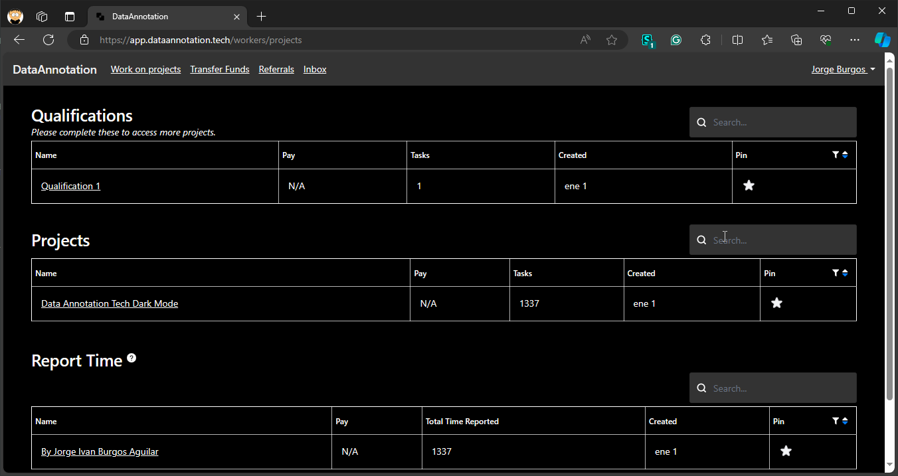

# Data Annotation Tech Dark Mode

## Installation

1. Install Stylus
   - [Firefox](https://addons.mozilla.org/en-US/firefox/addon/styl-us/)
   - [Chrome or Edge](https://chrome.google.com/webstore/detail/stylus/clngdbkpkpeebahjckkjfobafhncgmne)
2. Install [DataAnnotationTechDarkMode.user.css](https://userstyles.world/style/14468/data-annotation-tech-dark-mode).

## FAQ

1. Do you accept pull requests?
   - Yes
2. Why do you have Intel One Mono as an font option?
   - It is my personal preference as it enhances focus and improves readability. If you find it difficult to focus or read, [this font](https://www.intel.com/content/www/us/en/company-overview/one-monospace-font.html) might be beneficial. It was designed by Intel to optimize legibility.
3. Is this better than dark reader add-on?
   - No, this is just a personal alternative, developed and maintained by me to improve my work UI.
